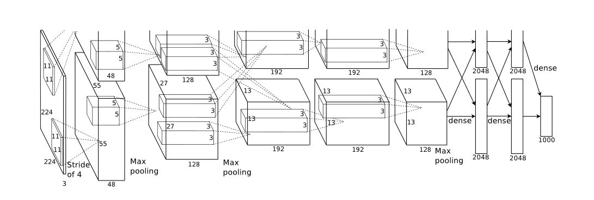
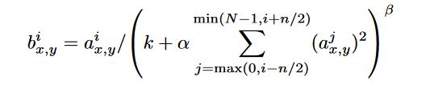
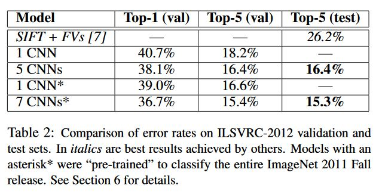

I've been recently been doing a paper reading of the original AlexNet and VGG paper. I've always been interested in Computer Vision given how supposedly interpretable Convolutional Models (Especially Classification ones) are. 

I started with the original paper which started the Neural era in Computer Vision, The [Alexnet](https://papers.nips.cc/paper/4824-imagenet-classification-with-deep-convolutional-neural-networks.pdf) paper which took the ILSVRC-2012 competition by storm. The most notable part of its win that the margin error rate between the previous year and the 2012 year and also the margin error rate between the first and second place were large (Showing the promise of Convolutional Networks.) 

This is in retrospection also called the Imagenet Moment in CV, because after this research in Computer Vision shifted gears from Traditional Methods to Neural ones and majorly using Convolutional Networks for the task. Until then, They(CNNs) hadn't been applied in large scale to high resolution images. 

## Understanding Alexnet

Alexnet was trained keeping in mind the need for models with the ability to learn over a variety of classes. It was trained on the ImageNet Dataset which contains 1.2 million images spanning a 1000 classes, the dataset is the standard dataset for CV now, All newer models are released with weights trained on imagenet(generally). The dataset also has 50000 validation images and 150,000 testing images. 

The original architecture of alexnet had 5 convolutional layers which were then followed by three fully connected layers. 

>Image -> Conv1 -> ResponseNormalization -> MaxPooling -> Conv2 -> ResponseNormalization  -> MaxPooling -> Conv3 -> Conv4 -> Conv5 -> MaxPooling -> Fc1 -> Fc2 -> Fc3 -> softmax(1000)

With Imagenet having variable-resolution images, it was downsampled to a fixed resolution of 256*256. Data Augmentation was done to reduce overfitting, The first form of data augmentation consists of image translations and horizontal reflections for this 224 * 224 patches are extracted from the 256 * 256 image. This increases the size of the training set by 2048 because (256-224) * (256-224) * 2, multiplying by 2 to account horizontal reflections. At the test time, 10 patches of the 256 * 256 image are used and averaged to tell the final prediction. The other alteration includes, performing PCA on the set of RGB pixels. This data augmentation is now standard for all most imagenet training setups. Finally Dropout is employed, Dropout is basically the notion of setting the output of a hidden neuron to zero with a probability of 0.5, these neurons whose output is set to zero do not participate in backprop either. 

Training details that were employed included using the relu activation function, Using multiple GPUs, Local Response Normalization, Overlapping pooling, data augmentation and dropout. The relu activation function was found to reach 25% error rate on CIFAR-10 6 times faster than tanh neurons. Multiple GPUs made it possible to train such a large network. 

Local Response normalization was added to aid generalization given by the above equation, where k, n, alpha and beta are hyperparameters, N is the total number of kernels in the layer. Overlapping pooling is employed instead of non-overlapping ones, A pooling layer can be thought of as summarizing a grid of pixel values to a singular values, when these grids are adjacent they are non-overlapping, and when some of these pixel values overlap, they are called overlapping. 

Understanding the network itself, First a 224 * 224 * 3 image is convolved with 96 kernels of 11 * 11 * 3 with stride 4. The formula for calculating the output dimensions at the end of each convolution layer is given as follows:

<h3> ((W-F+2P)/S) + 1 </h3>

where, W is the input volume size, F is the size of the filter, P is the size of the padding and S is the size of the stride. So plugging the values W = 224, F = 11, P = 0, S = 4, you end up with 55, i.e 55 * 55 * 96, due to space constraints this was split into two GPUs hence the output is of the form 55 * 55 * 48. This is then put through a maxpooling layer, resulting into 27 * 27 * 48. 

Something to keep in mind at this point is that the kernels of the second, fourth and fifth convolutional layers are connected only to those kernels residing on the same gpu. Therefore this results into, the second layer having the filter size as 5 * 5 * 48 instead of 5 * 5 * 96. After passing the output of the first layer, through the 256 kernels of layer two we end up with 27 * 27 * 256, which is then passed throught 384 kernels of 3 * 3 * 256, which is then respectively passed through the 4th and 5th convolutional layers of 3 * 3 * 192 each with 384 and 256 kernels respectively. The fully connected neurons have 4096 neurons each.  

Alexnet is trained with Stochastic gradient descent with a batch size of 128 examples, a momemtum of 0.9 and weight decay of 5e-4. The results are as follows.

